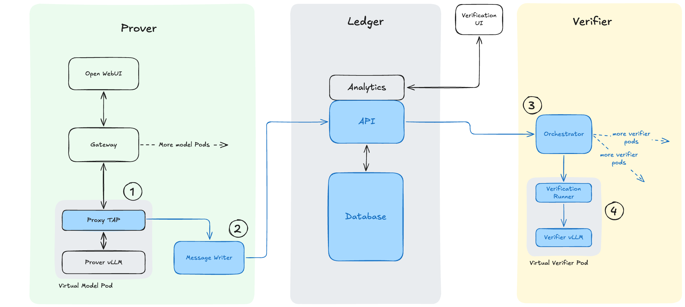
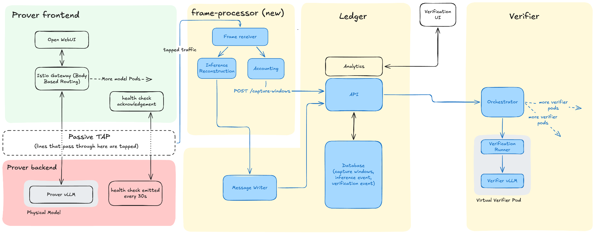
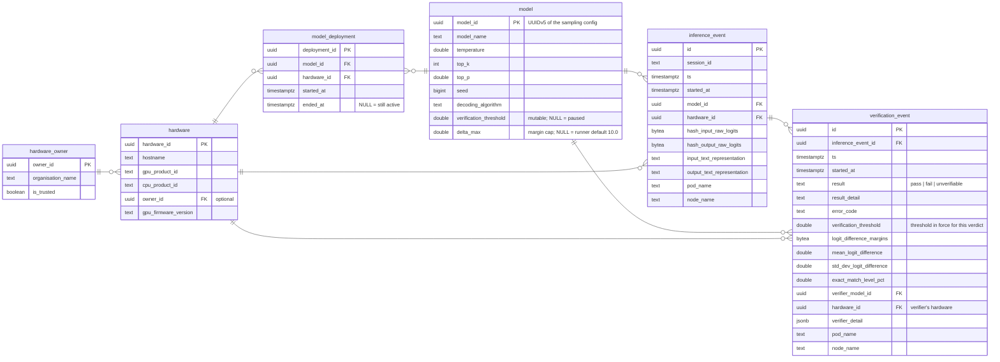

# Inference Recomputation Prototype

A prototype stack for **asynchronous verification of LLM inference**. It taps
inference traffic from a serving model (the *prover*), records every inference
in a ledger, and later has an independent model instance (the *verifier*)
recompute it. The two are compared with the
[DiFR](https://arxiv.org/abs/2511.20621) logit-difference test to decide
whether the prover actually ran the model and sampling configuration it
claimed.

The design and the results behind it are described in two accompanying posts:

- **[Scaling Recomputation Inference Verification](https://amododesign.com/notes/2026-09-02-scaling-recomputation-inference-verification/)**
  covers the verification stack.
- **[Fitting a Network TAP to our Inference Verification Prototype](https://amododesign.com/notes/2026-09-15-network-tap-inference-verification/)**
  covers the hardware tap (`frame-processor`).

> This is research prototype code. It is published so the work can be
> reproduced and built on. It is not production software and comes with no
> warranty; see [License](#license).

## How it works

1. **Tap.** Every prover pod runs a `verify-tap` sidecar (the `inf-proxy`
   image) in front of vLLM. It forwards OpenAI-compatible requests to the
   model with two kinds of adjustment: it adds reporting flags so the
   response carries token IDs and logprobs, and it pins the seed,
   temperature, top_k and top_p to the values declared for that deployment,
   overriding whatever the client sent. The generated text is passed back
   unmodified. Once a response completes, the sidecar posts a copy of the
   prompt, output token IDs and metadata to the message writer. The client is
   never blocked or delayed.

   A sidecar is trusted code on the prover's own host, so the stack also
   supports capturing the same inferences from the network instead — see
   [Two ways to capture](#two-ways-to-capture) below.
2. **Record.** The message writer resolves which model deployment produced
   the inference (by hostname and timestamp) and writes an
   `inference_event` to the ledger, a Postgres database fronted by a small
   FastAPI service.
3. **Schedule.** The orchestrator polls the ledger for models that have
   pending events *and* a verification threshold set. For each such model it
   spawns a dedicated verifier vLLM plus a runner Job, and tears the pair
   down again when the queue drains.
4. **Recompute.** The runner replays each inference through the verifier with
   `prompt_logprobs`, computes the per-token logit margins, and writes a
   `verification_event` with a pass / fail / unverifiable verdict.
5. **Inspect.** The verification UI shows ledger state, verdicts and margin
   distributions, and lets an operator set per-model thresholds. Where the
   hardware tap is running, a Capture tab reports whether the tapped link
   was fully accounted for over each window, so an event can be told apart
   from one the capture may have missed. Optional services enrich events with
   GPU activity from DCGM and drive benchmarking runs.

Prover pods and verifier vLLMs need GPUs. Everything else is CPU-only.

## Two ways to capture

Step 1 is the only step with a choice in it. Both routes produce the same
`inference_event` rows through the same message writer, and everything
downstream — ledger, orchestrator, runner, UI — is identical. What differs is
how much the prover has to be trusted for the record to mean anything.

### Proxy tap — `inf-proxy`

The tap is a sidecar container beside vLLM in the prover pod. It sees every
request in plaintext before and after the model, which is what lets it pin the
sampling configuration and declare the deployment as well as copy the traffic.
The numbered callouts match the steps above: (1) the proxy tap in the model
pod, (2) the message writer, (3) the orchestrator, (4) a verifier pod with its
runner and vLLM. Not shown: the GPU enricher and prompt runner, which sit
alongside the analytics API.

This is the path every deployment has, and it needs no special hardware. Its
limit is structural: the tap is software running on the machine it observes,
so a prover that controls its own host controls its own tap.

### Hardware tap — `frame-processor`

The design is written up in
**[Fitting a Network TAP to our Inference Verification Prototype](https://amododesign.com/notes/2026-09-15-network-tap-inference-verification/)**.

A passive optical tap is spliced into the link between the prover's frontend
and the model serving its backend, and mirrors it. `frame-processor` runs on a
different machine, reads the mirrored frames, and does two separate jobs with
them:

- **Inference reconstruction** — reassembles the TCP, parses the HTTP
  exchanges, and emits the same tap messages `inf-proxy` sends, so the events
  are directly comparable with the sidecar's.
- **Accounting** — classifies *every* frame on the link, whether or not it is
  inference, and files a `capture_window` per interval with a finding for
  anything outside the declared whitelist. Non-inference traffic is not
  ignored; it is counted and explained.

Nothing here is in the serving path, and the prover is not asked to
cooperate — the evidence is collected somewhere it cannot reach.

Two things make that claim hold. The link carries a **declared health check**,
a fixed datagram every 30 seconds that the far end answers: without it a
capture that has gone blind and a link with no inference on it produce
identical evidence, since every rule about arriving frames is satisfied by
nothing arriving. And the prover moves **out of the cluster** — a CNI, VXLAN
encapsulation and control-plane chatter would otherwise fill the link with
frames nobody can enumerate. `isolated_prover_setup/` is that prover, with its
traffic curated down to inference plus the health check.

The cost is everything the sidecar did besides copying traffic: sampling is no
longer pinned, the deployment is no longer self-declaring, and GPU attribution
has no pod to name. See
[`isolated_prover_setup/gpt-oss-120b/README.md`](isolated_prover_setup/gpt-oss-120b/README.md).

The two are not exclusive. Running both against one prover files two events per
inference, which is how each tap's rendering was validated against the other.

## Repository layout

| Path | Function |
|---|---|
| `inf-proxy/` | Captures inference traffic — the proxy tap. Runs as a sidecar in front of each prover, pins the declared sampling parameters and requests token IDs on each call, forwards the response as-is, and sends a copy of every completed inference to the message writer. Nginx plus a FastAPI app. |
| `frame-processor/` | Captures inference traffic from the network — the hardware tap. Reconstructs HTTP exchanges from raw frames off a hardware tap on the prover's uplink, emits the same tap messages as `inf-proxy`, and accounts for every frame on the link against a declared whitelist so unexplained traffic becomes a finding. Python, AF_PACKET. |
| `message-writer/` | Turns tap messages into ledger records. Resolves which model deployment produced an inference by hostname and timestamp, then creates the `inference_event`. FastAPI. |
| `ledger/` | The system of record. Stores models, deployments, hardware, inference events and verification verdicts, and exposes them through a read/create API. Postgres with a FastAPI access layer. |
| `inf-ver-orchestrator/` | Decides when and where verification runs. Watches the ledger for models with pending events and a threshold set, spawns a verifier vLLM and runner Job per model, and reaps them when the queue drains. Python controller using the Kubernetes API. |
| `inf-ver-runner/` | Performs the verification. Replays each pending inference through the verifier with prompt logprobs, computes DiFR margins against the prover's tokens, writes a pass / fail / unverifiable verdict, and exits. Python, uses the vendored `difr` library. |
| `inf-ver-ui/` | Operator dashboard. Shows ledger state and verdicts, lets you set per-model thresholds, delete or replay events, launch benchmarking runs, and explore margin distributions in charts. Next.js and visx. |
| `analytics-api/` | Read-only aggregation for the UI across the core ledger and the measurement tables, so the UI never queries Postgres directly. FastAPI. |
| `gpu-enricher/` | Measures GPU cost. Attaches DCGM activity windows from Prometheus to each inference and verification event, so prover and verifier compute can be compared. FastAPI with a background poller. |
| `prompt-runner/` | Generates controlled load. Queues benchmarking runs that drive a deterministic prompt suite through Open WebUI at one or more prover models, and records per-request outcomes. FastAPI. |
| `difr/` | The verification algorithm. Vendored copy of the DiFR library used by the runner to score logit differences; see below. Python. |
| `isolated_prover_setup/` | Runs a prover outside Kubernetes, on the node the hardware tap observes. Docker Compose projects for vLLM and the health-check sender, plus systemd units to keep them up. Deployed by hand; ArgoCD does not watch it. |
| `kubernetes_setup/` | Deploys everything. ArgoCD applications and Kustomize manifests for storage, monitoring, Harbor, KServe model serving and the verification stack itself. |
| `docs/` | The architecture diagram used in this README. |

Each Python service is a standalone FastAPI app with its own `Dockerfile`,
`requirements.txt` and `tests/`. Components with additional documentation:
[`ledger/README.md`](ledger/README.md),
[`inf-proxy/README.md`](inf-proxy/README.md),
[`message-writer/README.md`](message-writer/README.md),
[`frame-processor/README.md`](frame-processor/README.md),
[`kubernetes_setup/README.md`](kubernetes_setup/README.md),
[`isolated_prover_setup/README.md`](isolated_prover_setup/README.md).

### About the vendored DiFR library

"Vendored" means a copy of the upstream source is committed in this repository
under `difr/` rather than installed as a dependency. That pins the exact
verification code the results were produced with, and lets the runner import
it without a package index.

The upstream is [adamkarvonen/difr](https://github.com/adamkarvonen/difr),
released under the MIT License by Adam Karvonen. The copy here differs from
upstream in one way:

- **`difr/difr/gumbel_verify.py` is new.** The Gumbel-Max verification maths
  (`get_probs`, `verify_vllm_gumbel_max`, the top-k / top-p filters and the
  `TokenSequence` / `SimpleTokenMetrics` types) was moved out of
  `token_difr_vllm.py` into this module, which depends only on `torch`.
  `token_difr_vllm.py` re-exports the same names, so upstream's scripts keep
  working unchanged.

The reason is deployment weight. The verification runner needs only that
maths, so its image copies the single `gumbel_verify.py` file onto
`PYTHONPATH` instead of installing the package, and never pulls in the
research stack (vLLM, datasets, transformers, plotting) that the rest of
`difr` depends on. The remaining upstream scripts are kept so the original
experiments can still be reproduced from this repository.

## Running the stack

The stack is designed to run on Kubernetes. The cluster assumptions,
placeholders to replace, and notes on storage, networking, images, model
serving and GPU monitoring are in
[`kubernetes_setup/README.md`](kubernetes_setup/README.md). In outline:

**Prerequisites**

- A Kubernetes cluster with NVIDIA GPUs, the NVIDIA GPU Operator, MetalLB
  and ingress-nginx installed, and ArgoCD available.
- A container registry the cluster can pull from. The manifests assume a
  Harbor instance deployed by the same ArgoCD applications.
- `kubectl` and `docker` on your workstation.

**Steps**

1. **Fill in placeholders.** Search `kubernetes_setup/` for `<CHANGE_ME_`,
   `<ingress-lb-ip>`, `<org>/<repo>` and the `gpu-node-N` node names, and
   replace them with values for your cluster. The PersistentVolumes in
   `manifests/local-storage/` must point at real nodes and directories.
2. **Deploy the platform.** Point the ArgoCD Applications at your fork, then
   `kubectl apply -f kubernetes_setup/application-manifests/`. ArgoCD syncs
   storage, monitoring, Harbor, KServe, model serving and the `infver` stack
   itself. Kubeflow's CRDs take several retries to settle on first install.
3. **Build and push images.** Each service directory has a `Dockerfile`.
   Build all ten images and push them to your registry under the names the
   manifests expect (listed in the Kubernetes README). Two build from the
   repository root rather than their own directory, because each copies a
   file from outside it: `inf-ver-runner` (the vendored `difr/` package) and
   `frame-processor` (`inf-proxy`'s extractors). The root `.dockerignore`
   admits exactly their inputs, so a new `COPY` from the root context needs an
   entry there too.
4. **Check the prover's declaration.** The ledger must know each serving
   model's name and sampling configuration before its traffic can be
   resolved. The included model manifests handle this automatically: the
   `verify-tap` sidecar starts with `INF_PROXY_DECLARE=true`, discovers the
   model name from vLLM, and declares itself together with the seed,
   temperature, top_k and top_p it pins on every request. If you add a
   model, keep those environment variables on its sidecar. All four sampling
   values must be present and must match how the prover actually samples,
   otherwise verification is unverifiable or fails.
5. **Set a threshold.** In the verification UI, give the model a
   verification threshold. Until one is set, its events wait in the queue
   and verification is paused.
6. **Send traffic.** Chat through Open WebUI. Each response lands as an
   `inference_event`, the orchestrator spawns a verifier, and verdicts
   appear in the UI as the runner drains the queue.

**Optional: the hardware tap.** Steps 1-6 give you the proxy tap, which is
enough to run the whole verification loop. Capturing the same inferences from
the wire instead ([Two ways to capture](#two-ways-to-capture)) needs a passive
tap on a prover's link, a capture host for its monitor ports, and — to make the
link's accounting tractable — that prover moved out of the cluster. Start with
[`frame-processor/README.md`](frame-processor/README.md) and
[`isolated_prover_setup/README.md`](isolated_prover_setup/README.md).

## Data model

The ledger is the system of record. `model.model_id` is a UUIDv5 derived from
the sampling configuration (`model_name`, `temperature`, `top_k`, `top_p`,
`seed`, `decoding_algorithm`), so the same configuration always maps to the
same identity. `verification_threshold` is deliberately outside that hash: it
is a mutable operator setting, and `NULL` means verification is paused for
the model.

The DDL lives in `ledger/sql/`. Three further table families share the same
database but are owned and written only by their service, so a deployment
without the corresponding tooling has an identical core ledger:

| Tables | Owner |
|---|---|
| `enrichment_gpu_activity` | gpu-enricher |
| `benchmarking_run`, `benchmarking_run_result` | prompt-runner |
| `capture_window`, `capture_finding` | frame-processor |

The first two have no foreign keys into the core schema at all. The capture
tables have exactly one, `capture_window.hardware_id` → `hardware` (the
tapped node, nullable); no existing table gains a column, and an inference's
capture status is derived at read time by the `inference_event_capture` view
rather than stored, so a noisy link never changes a verification verdict. See
[`ledger/README.md`](ledger/README.md).

`analytics-api` is the one deliberate read-only reader across these
families.

## Logging

The ledger, message writer, inf-proxy, analytics API and GPU enricher share
one logging scheme:

- **Console**: `<ts> <LEVEL> [<component>] <logger>: <message>`, filterable
  by level or component. Verbosity is set with `LOG_LEVEL` (default `INFO`).
- **Error log file**: a per-component rotating file (5 MB, three backups)
  capturing `ERROR` and above regardless of `LOG_LEVEL`. Path is
  `ERROR_LOG_FILE` (default `logs/<component>-error.log`).

The orchestrator and runner log to the console only, at `INFO`, in the plainer
`<ts> <LEVEL> <logger> <message>` format. The prompt runner relies on uvicorn's
default logging.

The frame processor also logs to the console only, at `INFO`, as
`<ts> <logger> <LEVEL> <message>`; its capture and worker subprocesses add
`%(processName)s` so each reader and flow worker is identifiable in one
stream. Its startup lines are the only place the effective socket buffer, the
link policy and the ledger sink are reported, and are worth reading before
trusting a capture.

## License

This repository is released under the [MIT License](LICENSE). The software is
provided "as is", without warranty of any kind, and Amodo Design Ltd accepts
no liability for its use. It has not been validated for any particular purpose.

The MIT License covers the software only. The Amodo Design name, logo and any
other Amodo Design branding, including the UI icon, may not be reused for any
purpose without the explicit permission of Amodo Design Ltd.

The vendored `difr/` package is copyright Adam Karvonen and is also
distributed under the MIT License; see [`difr/LICENSE`](difr/LICENSE).
